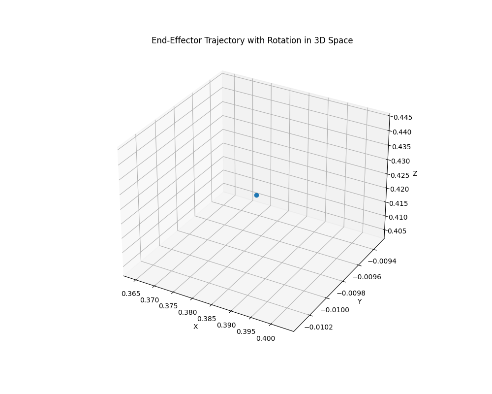

download dataset

```
mkdir data
```

install [gustil](https://cloud.google.com/storage/docs/gsutil_install), and download the dataset

```
gsutil -m cp -r gs://gresearch/robotics/droid_100 ./data
```



